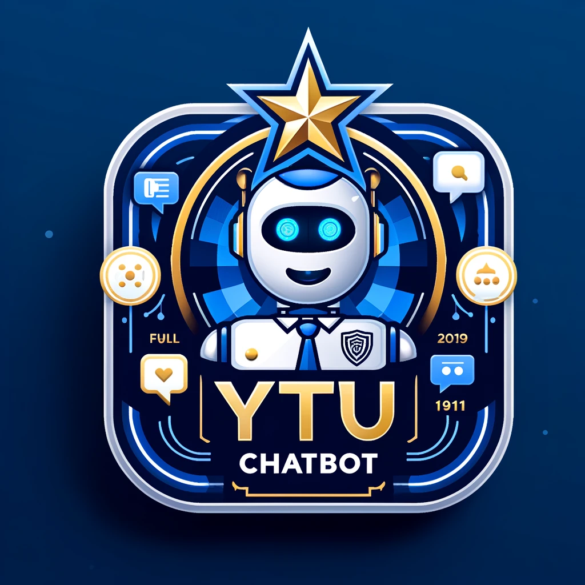
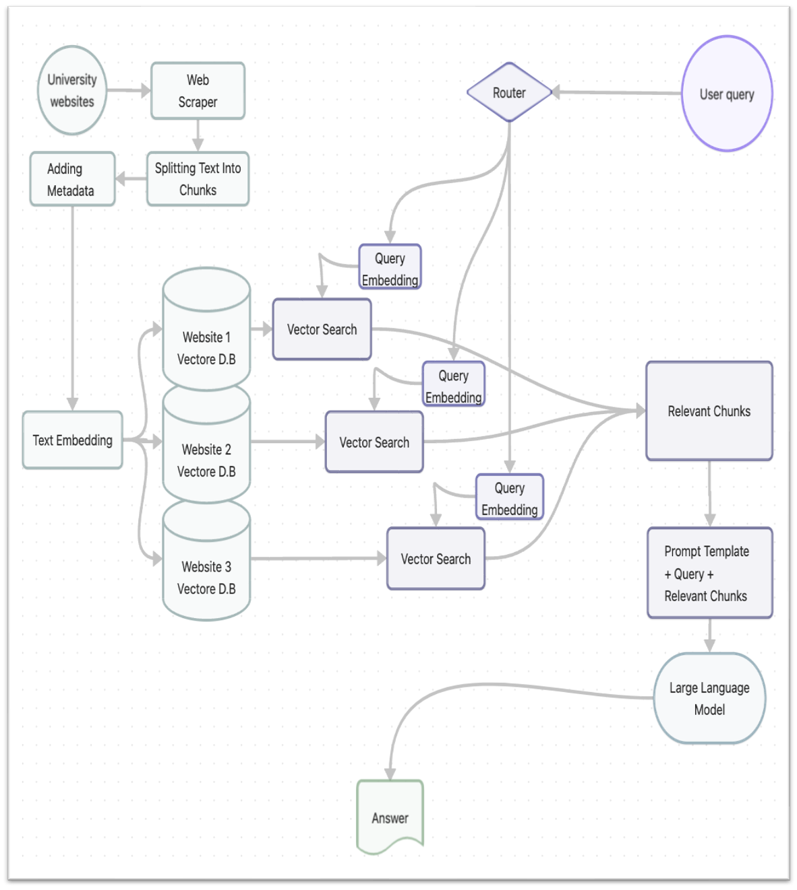
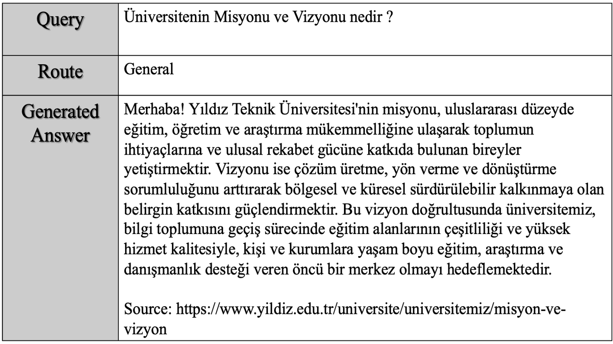
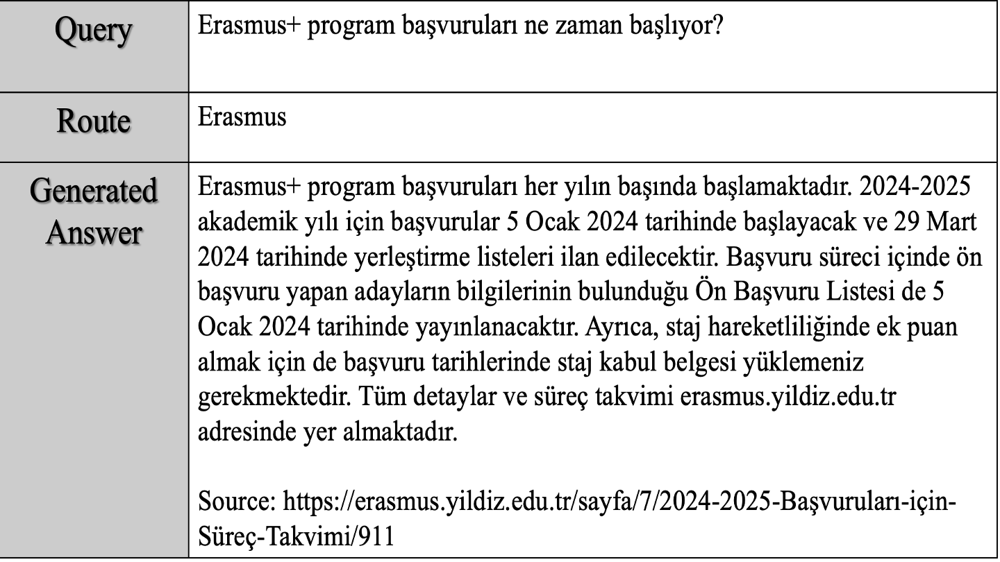

# YTU Chatbot

The YTU Chatbot is a pioneering project aimed at revolutionizing the way students interact with university websites. By integrating a custom chatbot using the latest advancements in Retrieval-Augmented Generation (RAG) and Large Language Models (LLMs), this project seeks to streamline the process of finding specific information, thereby enhancing the user experience and reducing the workload on administrative staff.

## Introduction

Navigating university websites can often be a daunting task for students, leading to repetitive inquiries that burden administrative staff. The YTU Chatbot project addresses this challenge head-on by leveraging a sophisticated RAG system combined with the power of LLMs. Utilizing cutting-edge tools such as GPT-3.5 Turbo, Chroma DB, and LangChain, our team has developed a system that not only efficiently organizes and retrieves information but also significantly improves the accuracy of responses provided to the users.

## Features

- **Efficient Information Retrieval:** Utilizes a Retrieval-Augmented Generation system to quickly find accurate information.
- **Integration with LLMs:** Leverages the capabilities of Large Language Models to understand and process user queries effectively.
- **Enhanced User Experience:** Aims to provide clear, concise, and correct answers to student inquiries, improving overall satisfaction.
- **Reduced Administrative Workload:** By automating responses to common questions, it significantly cuts down the time staff spend on repetitive tasks.

## Results

The implementation of the YTU Chatbot has shown promising results, with an accuracy of around 70% in providing correct answers to user inquiries. This highlights the system's potential to become an indispensable tool for students and staff alike, while also pointing towards areas for further improvement.

## Methodology

Our methodology revolves around the integration of RAG systems with LLMs to create a chatbot that is not only responsive but also highly accurate. By combining these technologies, we have set a new standard for information retrieval on university websites.

## Sample Responses

- **Sample RAG System Response 1**

  

- **Sample RAG System Response 2**

  

## Conclusion

The YTU Chatbot represents a significant step forward in making university websites more accessible and user-friendly. As we continue to refine and improve the system, we are confident that it will play a crucial role in enhancing the educational experience for students and easing the administrative burden on staff.

For more information and updates on the project, please stay tuned to this repository.